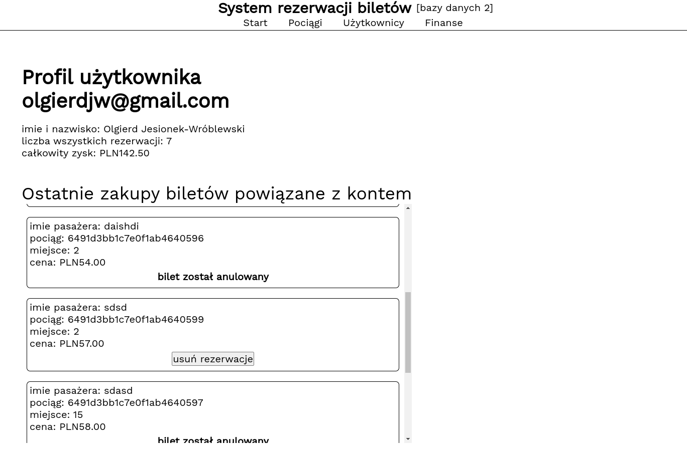

## System rezerwacji biletów kolejowych

## Technologie
| obszar | technologia      |
| ----------- |------------------|
| frontend | Angular          |
| backend | FastApi (Python) |
| baza danych | MongoDB          |


### Strona startowa

<br>
Komponent Angular'a pobiera dane kolekcji przez połączenie z backendem, a ten zaciąga je bezpośrednio z jedynego dokuemntu koleckji `main-database.statistics` w bazie MongoDb.
<br>

<br>

### Modyfikacja statystyk
Podczas zakupu biletu lub jego zwrotu statystyki wymagają aktualizacji.
<br>
Uwzględnienie nowego zakupu biletu:
```python
def new_reservation(discount: int, email: str, full_price: float):
    adult_price = discount == 100
    if adult_price:
        stats_collection.update_one({}, {"$inc": {"adult_tickets": 1}}, upsert=True)
    else:
        stats_collection.update_one({}, {"$inc": {"student_tickets": 1}}, upsert=True)

    last_reservation_time = datetime.now()

    update_data = {
        "$set": {"last_reservation_time": last_reservation_time},
        "$inc": {
            "total_reservations": 1,
            "revenue": full_price * (discount / 100)
        }
    }

    stats_collection.update_one({}, update_data, upsert=True)
    db["users"].update_one({"email": email}, {"$inc": {"total_reservations": 1}}, upsert=True)
```
Wycofanie zakupu:
```python
def delete_reservation(adult_price: bool, value: float):
    if adult_price:
        stats_collection.update_one({}, {"$dec": {"adult_tickets": 1}}, upsert=True)
    else:
        stats_collection.update_one({}, {"$dec": {"student_tickets": 1}}, upsert=True)

    stats_collection.update_one({}, {"$dec": {"revenue": value}}, upsert=True)

```

### Pociągi
W bazie MongoDb pociąg reprezentowany jest jak na poniższym obrazku.
Wolne miejsca w danym pociągu interpretujemy jako jedynki w masce `free_seats`.
<br>

<br>
FastAPI udostępnia pomocniczy interfejs pozwalający na przetestowanie endpointów serwera.
<br>

<br>
Endpoint `/trains/` backendu zwraca listę wszystkich pociągów.
Oto przykład zapytania wykonany przez automatycznie wygenerowaną dokumntację przez wbudowane narzędzie backend'u. 
<br>


### Dodawanie użytkownika
Klientów wprowadzamy do bazy przez prosty formularz.
<br>

<br>
Dodanie powoduje dodanie dokumentu użytkownika w kolekcji `users`.
<br>

<br>
Lista `history` zawiera informacje o **wszystkich** dokonanych zakupach powiązanych z kontem użytkownika.

Realizacja po stronie serwera wykorzystuje wspóldzielone modele:
```python
from pydantic import BaseModel, EmailStr
from dependencies import FromMongoDB

class UserRegister(BaseModel):
    email: EmailStr
    username: str

class UserServer(UserRegister):
    total_reservations: int

class UserDb(UserServer, FromMongoDB):
    pass
```
Model UserRegister używany jest do przekazania minimalnych danych wymaganych do rezerwacji.
UserServer dodaje pole do obsługi po stronie serwera.

```python
@router.post("/register")
def user_register(new_user: UserRegister) -> None:
    if get_user(new_user.email):
        raise HTTPException(status_code=404, detail="User already exists.")
    new_user = UserServer(**new_user.dict(), total_reservations=0)
    users_collection.insert_one(new_user.dict())
```

### Wybór miejsca w pociągu i dokonanie zakupu


Po wybraniu pociagu następuje wybór miejsca.
Każdy dokument pociągu posiada maską oznaczającą dostępność kolejnych miejsc.
Zaznaczenie miejsca czerwonego pokazuje szczególy rezerwacji.
W przypadku zaznaczenie miejsca wolnego, dostępna jest opcja zakupienia biletu.
Na jedno konto użytkownika można kupić wiele biletów. 
Bilety jednego użytkownika w jednym pociagu rozróżniane są przed przez dane z dodatkowego pola pozwalającego na indentyfikacje posiadacza biletu.
<br>

<br>
Informacje uzyskane podczas powyższego procesu posiadają reprezentację w kolekcji `main-database.reservations
` w postaci:
<br>

<br>
Otrzymanie zamówienia pod po stronie serwera skutkuje wykonaniem transakcji,
która dodaje zakup (rezerwacje) do kolekcji `main-database.reservations` jednocześnie zaznaczjąc brak dostepności miejsca w pociągu.
```python
@router.post("/make")
def make_reservation(request: ReservationBasic, user: UserDb = Depends(user_parser)):
    with client.start_session() as session:
        with session.start_transaction():
            // oszukanie pociągu
            train = trains_collection.find_one({"_id": ObjectId(request.train_id)}, session=session)
            if train is None:
                raise HTTPException(status_code=404, detail="Train not found")
            train: TrainDb = TrainDb.parse_obj(train)

            seat_taken: bool = train.free_seats[request.seat] == 0
            if seat_taken:
                raise HTTPException(status_code=404, detail="Seat number invalid or taken")

            // stworzenie i dodanie obiektu rezerwacji
            reservation = Reservation(
                email=user.email,
                train_id=train.id,
                seat=request.seat,
                reservation_time=str(int(datetime.now().timestamp())),
                discount=request.discount,
                ticket_username=request.ticket_username,
                canceled=False
            )
            reservations_collection.insert_one(reservation.dict(), session=session)

            // oznaczenie braku dostępności zdjęcia
            updated_seats: list[int] = train.free_seats
            updated_seats[request.seat] = 0
            trains_collection.update_one({'_id': ObjectId(train.id)}, {'$set': {'free_seats': updated_seats}},
                                         session=session)
            
            // dopisanie danych do statytyk i histori użytkownika
            log_new_reservation(request.discount, user.email, train.full_price)
            final_cost = train.full_price * (request.discount / 100)
            log_user_reservation(reservation, request.ticket_username, final_cost)
```

### Widok użytkownika
Pod formularzem dodania nowego konta, znajduje się lista wszyskich stworzonych kont użytkowników.
<br>

<br>

Możliwe jest przejście do strony użytkownika.
Oprócz podsumowania, widoczna jest historia zakupów.
Bilety wciąż aktywne mają możliwość anulowania.




Metoda dostaraczająca dane do panelu:

```python
@router.get("/details")
def users_list(email: str) -> dict:
    user: dict = users_collection.find_one({"email": email})
    if not user:
        raise HTTPException(status_code=404, detail="User not found.")
    return user
```


